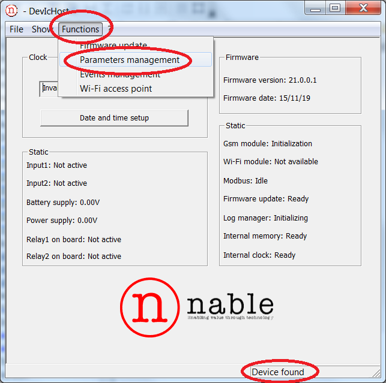
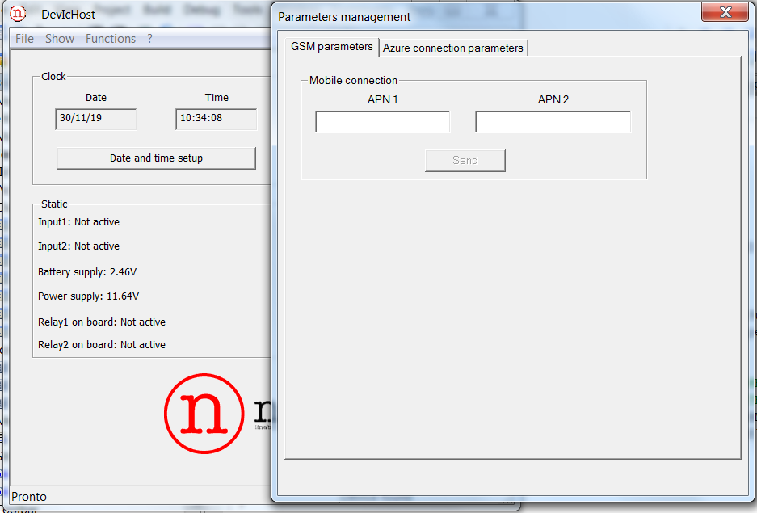
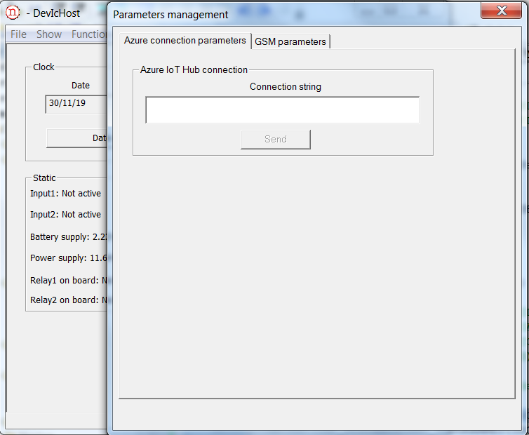
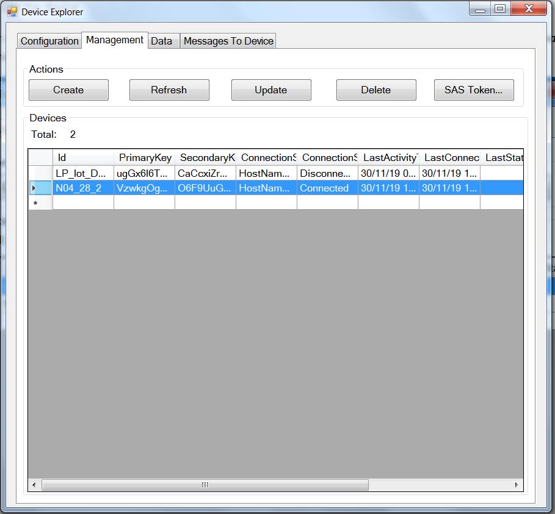
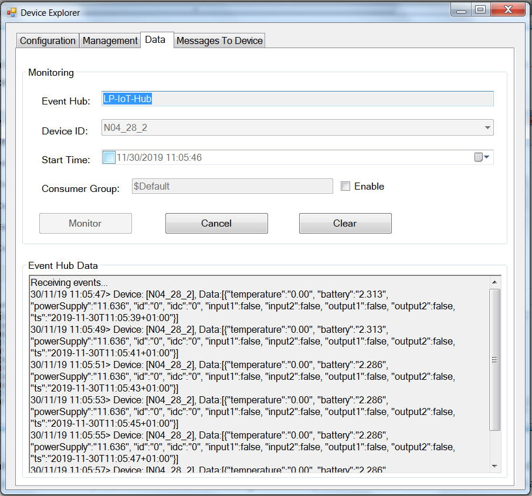

Connect N04 GSM device running FreeRTOS real time OS with Azure IoT SDK to IoT Hub
===
---

# Table of Contents

-   [Introduction](#Introduction)
-   [Step 1: Prerequisites](#Prerequisites)
-   [Step 2: Prepare your Device](#PrepareDevice)
-   [Step 3: Connect your Device to the Cloud](#ConenctToCloud)
-   [Next Steps](#NextSteps)

# Introduction

**About this document**

This document describes how to connect the __Nable__ programmable input output device __N04 GSM__ device running FreeRTOS real time OS with Azure IoT SDK. This multi-step process includes:
-   Prepare your device for cloud connection
-   Connect your device to Azure IoT Hub

# Step 1: Prerequisites

You should have the following items ready before beginning the process:

-   [Setup your IoT hub][lnk-setup-iot-hub]
-   [Provision your device and get its credentials][lnk-manage-iot-hub]
-   Ensure that the ***Nable USB driver for N04 GSM*** has been installed. If not, it can be downloaded from [here](https://www.eurosystems.it/DevIc/Drivers/CDCDriver/N04CDC.zip). After download unpack and install the driver.
-   Connect the __N04 GSM__ with its integrated USB service interface to your PC-side USB interface.

# Step 2: Prepare your Device

## Configure N04 GSM for Azure IoT Hub by using the DevIc Host tool

1. Download the DevIc Host tool executables from [here](https://www.eurosystems.it/DevIc/Host/DevIcHost.zip)

2. Launch the DevIc Host tool and click on functions menu / parameters management menu

  
 
3. Setup the APN of your mobile operator:

  

4. Setup the IoT Hub Connection String four your device:

  
  
5. Exit from parameters menù and power off you device

  

# Step 3: Connect your Device to the Cloud

1. Insert your SIM card in N04 GSM SIM card interface. The SIM card PIN must be removed before

2. Power ON the device

3. Launch the Device Explorer as described in [Provision your device and get its credentials][lnk-manage-iot-hub] and navigate to ***Management*** tab. Check the Connection State of your device in the list.

  

4. Navigate to the ***Data*** tab of the Device Explorer and select your device from the drop-down list of device IDs and click ***Monitor*** button. The Device Explorer is now monitoring data sent from the selected device to the IoT Hub.

  

## Documentation

The documentation for __N04 GSM__ can be found [here](https://nable.it/).

# Next Steps

You have now learned how to run a sample application that collects sensor data and sends it to your IoT hub. To explore how to store, analyze and visualize the data from this application in Azure using a variety of different services, please click on the following lessons:

-   [Manage cloud device messaging with iothub-explorer]
-   [Save IoT Hub messages to Azure data storage]
-   [Use Power BI to visualize real-time sensor data from Azure IoT Hub]
-   [Use Azure Web Apps to visualize real-time sensor data from Azure IoT Hub]
-   [Weather forecast using the sensor data from your IoT hub in Azure Machine Learning]
-   [Remote monitoring and notifications with Logic Apps]   

[Manage cloud device messaging with iothub-explorer]: https://docs.microsoft.com/en-us/azure/iot-hub/iot-hub-explorer-cloud-device-messaging
[Save IoT Hub messages to Azure data storage]: https://docs.microsoft.com/en-us/azure/iot-hub/iot-hub-store-data-in-azure-table-storage
[Use Power BI to visualize real-time sensor data from Azure IoT Hub]: https://docs.microsoft.com/en-us/azure/iot-hub/iot-hub-live-data-visualization-in-power-bi
[Use Azure Web Apps to visualize real-time sensor data from Azure IoT Hub]: https://docs.microsoft.com/en-us/azure/iot-hub/iot-hub-live-data-visualization-in-web-apps
[Weather forecast using the sensor data from your IoT hub in Azure Machine Learning]: https://docs.microsoft.com/en-us/azure/iot-hub/iot-hub-weather-forecast-machine-learning
[Remote monitoring and notifications with Logic Apps]: https://docs.microsoft.com/en-us/azure/iot-hub/iot-hub-monitoring-notifications-with-azure-logic-apps
[setup-devbox-linux]: https://github.com/Azure/azure-iot-sdk-c/blob/master/doc/devbox_setup.md
[lnk-setup-iot-hub]: https://github.com/Azure/azure-iot-device-ecosystem/blob/master/setup_iothub.md
[lnk-manage-iot-hub]: https://github.com/Azure/azure-iot-device-ecosystem/blob/master/manage_iot_hub.md
